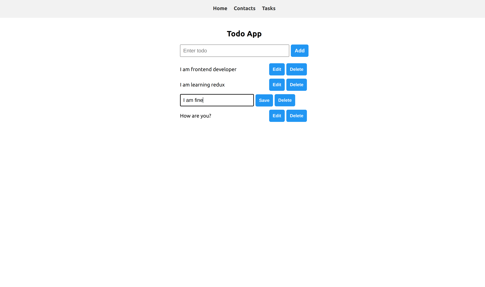
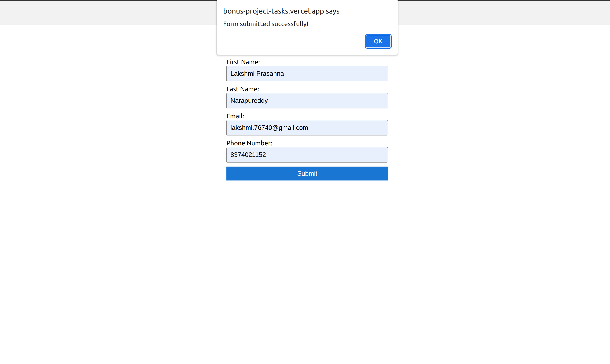
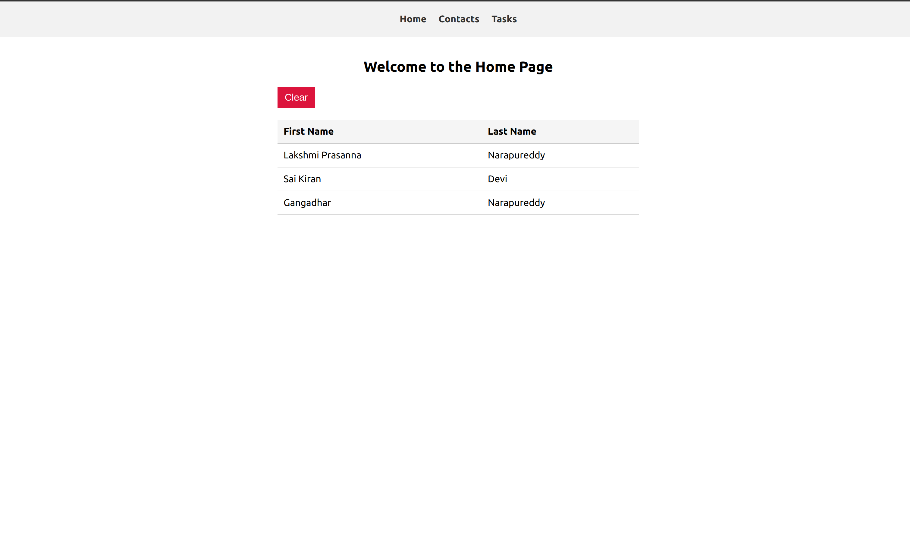

# Tasks Managing

### Deployed link: [Deployed link](https://bonus-project-tasks.vercel.app/)

### Task

### Contact Page

### Home page

* Created three pages Home,Contacts and Tasks
*  **Home Page:** Displayed simple welcome message & clear  button.
*  **Contact Page:** Includes a form & submit button. Save form data in local storage after successful submission. And display the stored First Name & Last Name on the  Home Page.
* Data stored in local storage can be cleared by clicking the Clear button on the home page, provided alert “Are you sure you want to clear” before clearing.
* **Task Page:** Created To-do task functionality in this page by temporarily holding tasks in an array with delete & update functionality.
* Tech stacks used:
   *  **HTML, CSS, JavaScript, React and Redux toolkit.**
